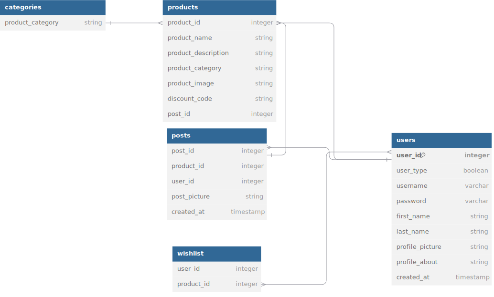

# Project Title

**_Vitrine_**

## Overview

**_Vitrine_** is a mobile app designed to empower bloggers and content creators by providing them with a storefront for affiliate marketing. The platform enables users to showcase products, save links, and curate wish lists, creating a seamless shopping experience for their audience.

### Problem Space

Many bloggers and content creators currently promote products through various platforms that lack the functionality to store links or allow users to create wish lists. This leads to lost opportunities for engagement and sales, as users cannot easily track or revisit the products they are interested in. Vitrine addresses these pain points by offering a dedicated space for creators to organize their affiliate products, thereby enhancing user experience and boosting sales potential.

### User Profile

**_Vitrine_** has two primary user profiles:

**1. Content Creators :** Bloggers and influencers who post about products. They will use the app to create and manage their storefronts, post product links, and engage with their audience through curated lists.

**2. Regular Users :** Shoppers and fans of content creators who explore products and make purchases. They will use the app to browse, save products to wish lists, and track affiliate links for easy access.

**For capstone deadline I will be building the features for type Content Creators.**

### Features

- User login (for Creator user type) : login for creators.
- Creator Profile: A centralized area for creators to add posts , add multiple products for each post, manage links , messages, etc.
- Post page : full screen view of post with product details and category.
- Product page: full screen view of product details and link to purchase.
- Create new post : feature to create new post with multiple products.

**Nice to have**

- login and features for "shopper" user type side.
- Home page: where users can search for products by category.
- Feed : search results from homepage.
- Wish-list Functionality: Users can save posts for future reference.

## Implementation

### Tech Stack

- React
- JavaScript
- Bootstrap
- Node.js with Express
- JSON for database management
- Client Libraries:
  - React Router for navigation
  - Axios for API requests
- Server Libraries:
  - Express for server setup

**Check for dependencies below.**

### APIs

List any external sources of data that will be used in your app.

- no external api is used.

### Sitemap

- Sign up / Login
  - Creator Profile
  - Post Page
  - Product Page
  - Post Upload Page
  - Messages Page
- User side
  - User/ Shoppers Home Page (Search bar)
  - Feed
  - Wish List Page

### Mockups

- Login Page:

- Creator Profile Page:

- Product Page:

- Product Upload Page:

- User/ Shoppers Home Page:

- Feed:

- Wish List Page:

- **_User Flow_**

### Data

\

Datasets are created in three json files.

- users.json
- posts.json
- categories.json

### Endpoints

List endpoints that your server will implement, including HTTP methods, parameters, and example responses.

- GET/users/:userid
- GET /posts/:userid
- POST/posts/:userid
- PUT/posts/:userid

**Nice to have**

- POST/users/:id/whishlist
- DELETE/users/:id/wishlist
- More TBD

## Roadmap

Scope your project as a sprint. Break down the tasks that will need to be completed and map out timeframes for implementation working back from the
capstone due date.

1. Create git repository for front-end
2. Create git repository for back-end
3. Create components for

   - Profile page
   - Post page
   - Product page
   - Create Post page
   - User Login

4. Work on database architecture
5. Set up navigation
6. Set up routes in backend
7. Set up states for each page

---

## Future Implementations

Your project will be marked based on what you committed to in the above document. Here, you can list any additional features you may complete after the MVP of your application is built, or if you have extra time before the Capstone due date.

## Nice to have

- User login (for Shopper user type) : mock login for shoppers.
- Feed : Users can easily search for specific products or choose a category.
- Wish List Functionality: Users can save products they are interested in for future reference.
- POST/users/:id/whishlist
- DELETE/users/:id/wishlist
- More TBD
- Notifications: Alerts for users when products on their wish lists go on sale or are featured by their favorite creators.

## Dependencies

- client:
  "@popperjs/core": "^2.11.8",
  "@types/node": "^22.7.6",
  "axios": "^1.7.7",
  "bootstrap": "^5.3.3",
  "bootstrap-icons": "^1.11.3",
  "multer": "^1.4.5-lts.1",
  "react": "^18.3.1",
  "react-bootstrap": "^2.10.5",
  "react-dom": "^18.3.1",
  "react-router-dom": "^6.27.0"
- server:
  "cors": "^2.8.5",
  "dotenv": "^16.4.5",
  "express": "^4.21.1",
  "fs": "^0.0.1-security",
  "multer": "^1.4.5-lts.1"
